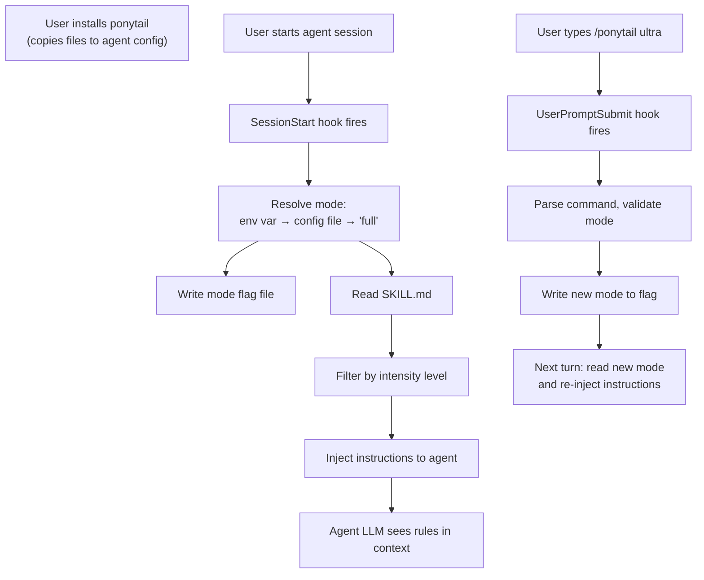

# Runtime Flow

## Overview

Ponytail is not a traditional application with a single entry point and process lifecycle. Instead, it is a plugin system that hooks into agent harnesses at specific points and injects rules on demand.

There are two main flows:
1. **Installation flow**: User installs ponytail into their agent; configuration and defaults are set up
2. **Session/command flow**: Agent fires lifecycle events; hooks/plugins detect, read config, inject rules, track mode

## Installation Flow

When a user installs ponytail:

1. Platform-specific files are copied to the agent's config directory (e.g., `~/.claude/plugins/ponytail`)
2. User is guided to register ponytail hooks or enable the plugin (platform-specific)
3. Configuration defaults are established (mode defaults to 'full' unless overridden)

No setup beyond this is required. No environment variables must be set unless the user wants custom defaults.

## Session Startup

When a user starts an agent session (e.g., opens Claude Code, runs Codex, invokes Pi):

1. **Hook fires**: SessionStart event triggers `ponytail-activate.js` (Claude/Codex) or plugin's initialization handler (OpenCode/Pi)

2. **Mode resolution**: `ponytail-config.js` determines the effective mode:
   - Check `PONYTAIL_DEFAULT_MODE` environment variable
   - Check config file at `~/.config/ponytail/config.json` (or platform-specific location)
   - Fall back to 'full'

3. **Mode persisted**: `ponytail-runtime.js` writes the resolved mode to a flag file (agent-specific path)

4. **Statusline config detected**: For Claude Code only, check if `.claude/settings.json` has a statusline badge; if not, nudge user to set it up

5. **Instructions injected**: `ponytail-instructions.js` reads `skills/ponytail/SKILL.md`, filters it by the active intensity level, and emits the result:
   - Claude Code: written as plain text to stdout
   - Codex: written as JSON systemMessage
   - OpenCode: appended to system prompt on every turn
   - Pi: exported as functions for integration
   - Other editors: static rule files pre-installed

The injected instructions become context for the agent's LLM, active for the entire session.

## User Command: Change Mode

When a user types `/ponytail ultra` (or equivalent in their agent syntax):

1. **Hook fires**: UserPromptSubmit event (Claude/Codex) or command handler (OpenCode/Pi)

2. **Command parsed**: `ponytail-mode-tracker.js` (Claude/Codex) or equivalent detects the command and extracts the requested mode

3. **Mode validated**: Requested mode is checked against VALID_MODES

4. **Mode persisted**: Valid mode is written to the flag file via `ponytail-runtime.js`

5. **Instructions updated**: On the next turn, the hook/plugin reads the new mode and injects updated instructions

The mode change takes effect starting with the next agent turn (not the current one).

## Mode Resolution Hierarchy

```
PONYTAIL_DEFAULT_MODE env var (highest priority)
    ↓ (if not set)
~/.config/ponytail/config.json → defaultMode field
    ↓ (if file missing or field absent)
'full' (hardcoded default)
```

Platform-specific config paths:
- Linux/macOS: `$XDG_CONFIG_HOME/ponytail/config.json` or `~/.config/ponytail/config.json`
- Windows: `%APPDATA%\ponytail\config.json`

## Platform-Specific Differences

### Claude Code
- **Hook mechanism**: Node.js scripts in `hooks/` directory, registered in `hooks.json`
- **Activation**: SessionStart and UserPromptSubmit events
- **Status indicator**: Statusline badge showing active mode (if configured)
- **Flow**: Hook → read config → inject text → user sees instructions in context
- **Mode switching**: `/ponytail lite` command parsed by hook and persisted

### Codex
- **Hook mechanism**: Same as Claude Code, but JSON output format
- **Activation**: SessionStart and UserPromptSubmit events
- **Flow**: Hook → JSON output with systemMessage → Codex embeds in system prompt
- **Mode switching**: Same as Claude Code

### OpenCode
- **Hook mechanism**: ES module plugin with command and transform handlers
- **Activation**: Every turn via `experimental.chat.system.transform`
- **Flow**: Plugin → read config → append instructions to system prompt → LLM sees rules
- **Mode switching**: `/ponytail lite` command → command handler → writes flag → next turn reads new mode

### Pi
- **Hook mechanism**: ES module extension exporting resolver functions
- **Activation**: Pi harness calls exported functions on demand
- **Flow**: Extension → resolve mode → generate instructions → harness embeds in context
- **Mode switching**: User-provided flag or in-session API call

### Static rule files (Cursor, Windsurf, Kiro, Cline)
- **Hook mechanism**: None; files are read directly by agent on startup
- **Activation**: Agent initialization
- **Flow**: Agent reads `.cursor/rules/*.mdc`, etc. → rules active for session
- **Mode switching**: Not supported; mode is determined by file content

## Runtime Flow Diagram



## Important State Files

| Path | Agent | Purpose | Example |
|---|---|---|---|
| `~/.claude/.ponytail-active` | Claude Code | Stores current mode | `ultra` |
| `${PLUGIN_DATA}/.ponytail-active` | Codex | Stores current mode | `lite` |
| `~/.config/opencode/.ponytail-active` | OpenCode | Stores current mode | `full` |
| `~/.config/ponytail/config.json` | All | User default mode | `{"defaultMode":"ultra"}` |

## Key Files in Flow

| File | Role in Flow |
|---|---|
| `hooks/ponytail-config.js` | Resolves effective mode from env/config/default |
| `hooks/ponytail-activate.js` | Fires on SessionStart; writes mode flag and injects instructions |
| `hooks/ponytail-mode-tracker.js` | Fires on UserPromptSubmit; detects and persists mode changes |
| `hooks/ponytail-instructions.js` | Reads SKILL.md and filters by intensity level |
| `hooks/ponytail-runtime.js` | Manages flag files and hook output formatting |
| `.opencode/plugins/ponytail.mjs` | OpenCode-specific plugin with command and transform handlers |
| `pi-extension/index.js` | Pi-specific extension exporting mode resolution and instruction building |
| `skills/ponytail/SKILL.md` | Source of truth for injected rules |
