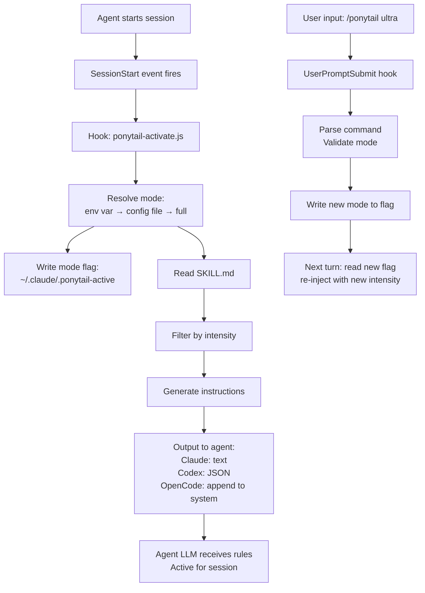
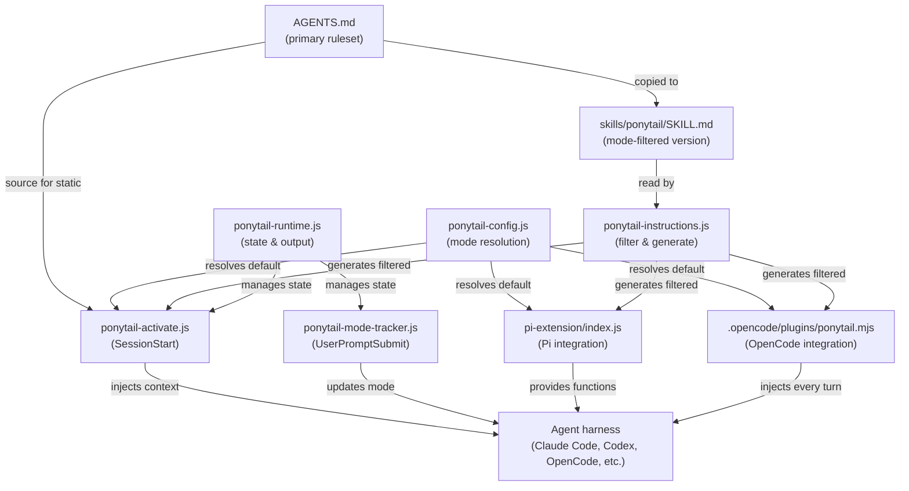
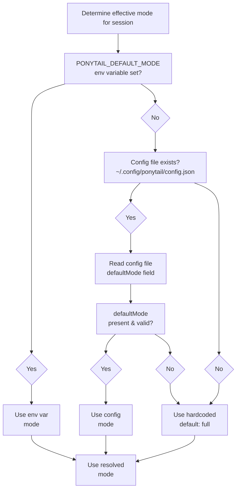
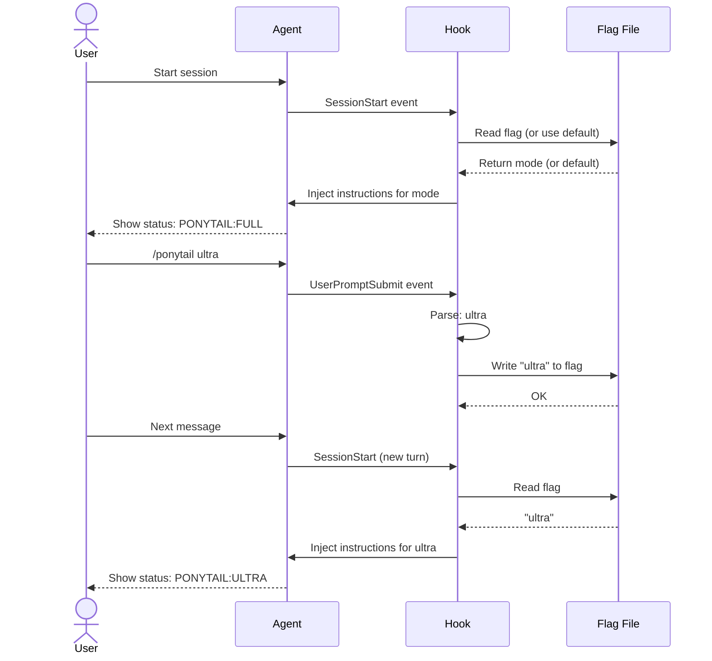
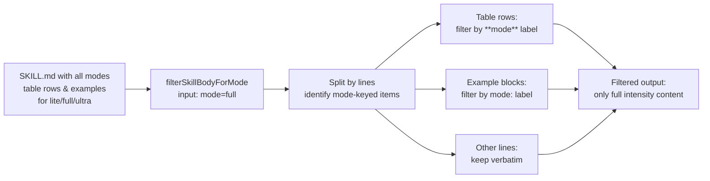
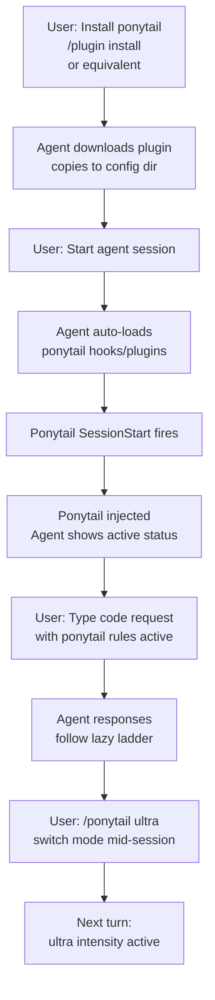
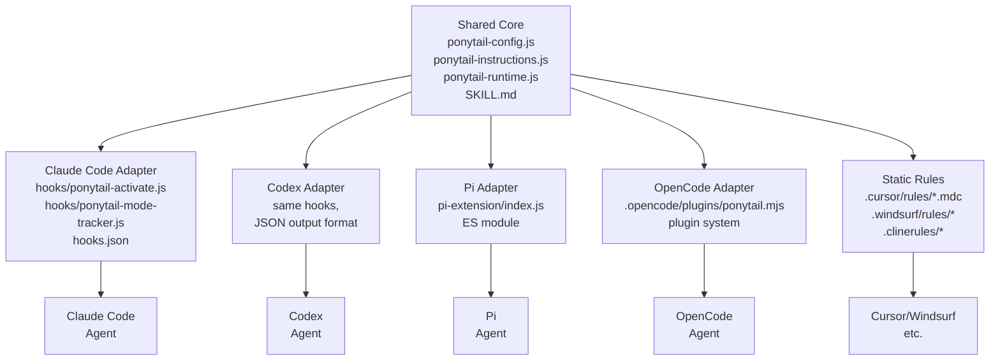

# Diagrams

## 1. Runtime Activation Flow

## 2. Module Interaction Diagram

## 3. Configuration Resolution Hierarchy

## 4. Mode Persistence Across Turns

## 5. Mode Filtering in SKILL.md

## 6. Installation to Active Flow (User Perspective)

## 7. Platform Adapter Architecture

## Notes on Diagram Accuracy

- All diagrams represent real code flow and module relationships found in the repository
- Sequence diagram (4) shows typical multi-turn session; specific timings depend on agent harness
- Module interaction (2) shows data flow; not all dependencies are shown for clarity
- Configuration hierarchy (3) is implemented in `ponytail-config.js` `getDefaultMode()`
- Mode filtering (5) is implemented in `ponytail-instructions.js` `filterSkillBodyForMode()`
